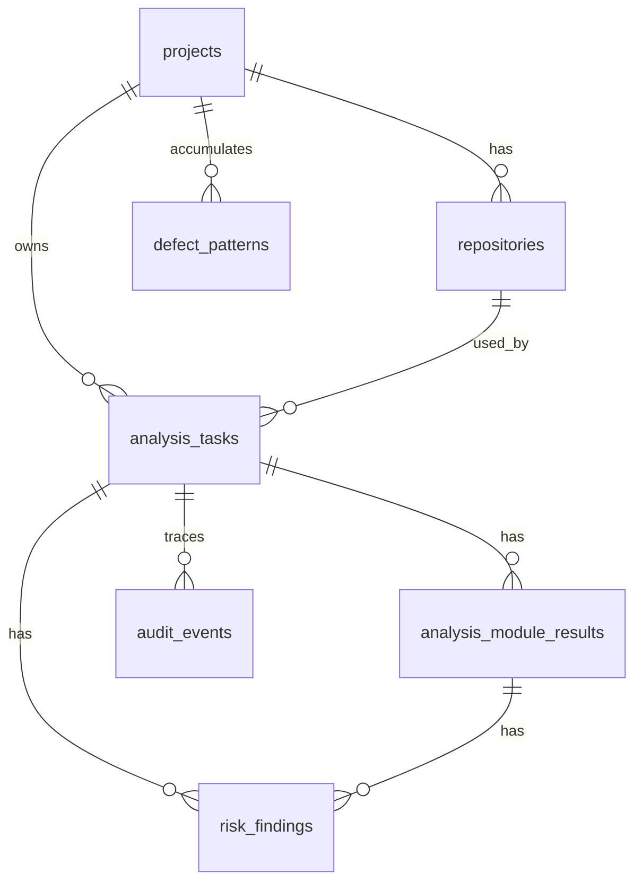

# GrayScope 数据库表结构（V1）

## 1. 范围与存储策略

- **默认引擎**：SQLite（开发）/ PostgreSQL（预发、生产）
- **ORM**：SQLAlchemy 2.x
- **迁移工具**：Alembic
- **命名**：snake_case
- **时间戳**：UTC 带时区

## 2. 实体概览



## 3. 表定义

### 3.1 `projects` — 项目

**用途**：顶层工作空间边界。

| 列名 | 类型 | 约束 | 说明 |
|------|------|------|------|
| id | BIGINT | PK | 主键 |
| name | VARCHAR(64) | NOT NULL, UNIQUE | 项目名称 |
| description | VARCHAR(512) | NULL | 项目描述 |
| created_at | TIMESTAMPTZ | NOT NULL | 创建时间 |
| updated_at | TIMESTAMPTZ | NOT NULL | 更新时间 |

**索引：**

- `UNIQUE(name)`
- `INDEX(status, created_at DESC)`（若存在 status 列）

---

### 3.2 `repositories` — 仓库

**用途**：按项目绑定的 Git 仓库。

| 列名 | 类型 | 约束 | 说明 |
|------|------|------|------|
| id | BIGINT | PK | 主键 |
| project_id | BIGINT | NOT NULL, FK → projects.id | 所属项目 |
| name | VARCHAR(128) | NOT NULL | 仓库名称 |
| clone_url | TEXT | NOT NULL | 克隆地址（实现中可为 git_url） |
| local_mirror_path | TEXT | NOT NULL | 本地镜像路径 |
| created_at | TIMESTAMPTZ | NOT NULL | 创建时间 |
| updated_at | TIMESTAMPTZ | NOT NULL | 更新时间 |

**索引：**

- `UNIQUE(project_id, name)`
- `INDEX(project_id, updated_at DESC)`

**说明**：实现中可能包含 `last_sync_status`、`last_sync_at`、`default_branch` 等扩展列。

---

### 3.3 `analysis_tasks` — 分析任务

**用途**：每次分析执行的一条记录。

| 列名 | 类型 | 约束 | 说明 |
|------|------|------|------|
| id | BIGINT | PK | 主键 |
| task_id | VARCHAR(64) | NOT NULL, UNIQUE | 外部任务 ID（如 tsk_xxx，可视为逻辑 UUID） |
| project_id | BIGINT | NOT NULL, FK → projects.id | 项目 ID |
| repo_id | BIGINT | NOT NULL, FK → repositories.id | 仓库 ID |
| task_type | VARCHAR(16) | NOT NULL | full \| file \| function \| diff \| postmortem |
| status | VARCHAR(16) | NOT NULL | pending \| running \| partial_failed \| success \| failed \| cancelled |
| target_json | JSONB/TEXT | NOT NULL | 分析目标（路径、函数列表等） |
| revision_json | JSONB/TEXT | NOT NULL | 版本信息（分支、base/head 提交） |
| analyzers_json | JSONB/TEXT | NOT NULL | 启用的分析模块 ID 列表 |
| ai_json | JSONB/TEXT | NOT NULL | AI 提供商与模型配置 |
| options_json | JSONB/TEXT | NULL | 分析选项（深度、阈值等） |
| aggregate_risk_score | DOUBLE PRECISION | NULL | 聚合风险分 |
| idempotency_key | VARCHAR(128) | NULL, UNIQUE | 幂等键 |
| created_at | TIMESTAMPTZ | NOT NULL | 创建时间 |
| updated_at | TIMESTAMPTZ | NOT NULL | 更新时间 |

**索引：**

- `UNIQUE(idempotency_key)` WHERE idempotency_key IS NOT NULL
- `INDEX(project_id, created_at DESC)`
- `INDEX(repo_id, created_at DESC)`
- `INDEX(status, updated_at DESC)`

**说明**：实现中可能包含 `error_json`、`created_by`、`finished_at` 等列。

---

### 3.4 `analysis_module_results` — 分析模块结果

**用途**：按模块持久化结果，支持部分成功与重试。

| 列名 | 类型 | 约束 | 说明 |
|------|------|------|------|
| id | BIGINT | PK | 主键 |
| task_id | BIGINT | NOT NULL, FK → analysis_tasks.id | 所属任务 |
| module_id | VARCHAR(32) | NOT NULL | 模块 ID（如 branch_path, error_path） |
| status | VARCHAR(16) | NOT NULL | success \| failed \| skipped \| cancelled \| running \| pending |
| risk_score | DOUBLE PRECISION | NULL | 模块风险分 |
| findings_json | JSONB/TEXT | NOT NULL | 发现列表 JSON |
| metrics_json | JSONB/TEXT | NULL | 指标 JSON |
| artifacts_json | JSONB/TEXT | NULL | 产物路径/描述 JSON |
| ai_summary_json | JSONB/TEXT | NULL | AI 摘要 JSON |
| error_json | JSONB/TEXT | NULL | 错误信息 JSON |
| started_at | TIMESTAMPTZ | NULL | 开始时间 |
| finished_at | TIMESTAMPTZ | NULL | 结束时间 |
| created_at | TIMESTAMPTZ | NOT NULL | 创建时间 |
| updated_at | TIMESTAMPTZ | NOT NULL | 更新时间 |

**索引：**

- `UNIQUE(task_id, module_id)`
- `INDEX(task_id, status)`
- `INDEX(module_id, status)`

**约束**：`module_id` 取值须在允许的模块 ID 集合内（branch_path, boundary_value, error_path, call_graph, concurrency, diff_impact, coverage_map, postmortem, knowledge_pattern）。

---

### 3.5 `risk_findings` — 风险发现

**用途**：规范化风险项，便于查询与导出。

| 列名 | 类型 | 约束 | 说明 |
|------|------|------|------|
| id | BIGINT | PK | 主键 |
| task_id | BIGINT | NOT NULL, FK → analysis_tasks.id | 所属任务 |
| module_result_id | BIGINT | NULL, FK → analysis_module_results.id | 所属模块结果 |
| module_id | VARCHAR(32) | NOT NULL | 产出该发现的模块 ID |
| risk_type | VARCHAR(32) | NOT NULL | 风险类型 |
| severity | VARCHAR(8) | NOT NULL | S0 \| S1 \| S2 \| S3 |
| risk_score | DOUBLE PRECISION | NOT NULL | 风险分 |
| file_path | TEXT | NOT NULL | 文件路径 |
| symbol_name | VARCHAR(256) | NULL | 符号名（函数/变量等） |
| line_start | INT | NULL | 起始行 |
| line_end | INT | NULL | 结束行 |
| title | VARCHAR(256) | NOT NULL | 标题 |
| description | TEXT | NOT NULL | 描述 |
| evidence_json | JSONB/TEXT | NULL | 证据/结构化数据 JSON |
| created_at | TIMESTAMPTZ | NOT NULL | 创建时间 |

**索引：**

- `INDEX(task_id, risk_type, severity)`
- `INDEX(task_id, risk_score DESC)`
- `INDEX(file_path, line_start)`

---

### 3.6 `audit_events` — 审计事件

**用途**：操作与 AI 调用等可追溯元数据。

| 列名 | 类型 | 约束 | 说明 |
|------|------|------|------|
| id | BIGINT | PK | 主键 |
| request_id | VARCHAR(64) | NULL | 请求 ID |
| task_id | BIGINT | NULL, FK → analysis_tasks.id | 关联任务 |
| module_id | VARCHAR(32) | NULL | 关联模块 ID |
| event_type | VARCHAR(32) | NOT NULL | 事件类型 |
| actor | VARCHAR(64) | NULL | 操作者 |
| payload_hash | VARCHAR(128) | NULL | 载荷哈希 |
| payload_size | INT | NULL | 载荷大小（字节） |
| meta_json | JSONB/TEXT | NULL | 元数据 JSON |
| created_at | TIMESTAMPTZ | NOT NULL | 创建时间 |

**索引：**

- `INDEX(task_id, created_at DESC)`
- `INDEX(event_type, created_at DESC)`

---

### 3.7 `defect_patterns` — 缺陷模式（知识库）

**用途**：事后分析沉淀的缺陷模式，用于知识库与匹配。

| 列名 | 类型 | 约束 | 说明 |
|------|------|------|------|
| id | BIGINT | PK | 主键 |
| project_id | BIGINT | NOT NULL, FK → projects.id | 所属项目 |
| pattern_key | VARCHAR(128) | NOT NULL | 模式唯一键 |
| name | VARCHAR(256) | NOT NULL | 模式名称 |
| risk_type | VARCHAR(32) | NOT NULL | 风险类型 |
| trigger_shape_json | JSONB/TEXT | NOT NULL | 触发条件形态 |
| code_signature_json | JSONB/TEXT | NOT NULL | 代码特征/签名 |
| test_template_json | JSONB/TEXT | NOT NULL | 测试模板 |
| example_json | JSONB/TEXT | NULL | 示例 JSON |
| hit_count | INT | NOT NULL, DEFAULT 0 | 命中次数 |
| created_at | TIMESTAMPTZ | NOT NULL | 创建时间 |
| updated_at | TIMESTAMPTZ | NOT NULL | 更新时间 |

**索引：**

- `UNIQUE(project_id, pattern_key)`
- `INDEX(project_id, risk_type, hit_count DESC)`

---

## 4. 约束与完整性规则

- **C-001**：`analysis_tasks.repo_id` 所属仓库的 `project_id` 必须等于 `analysis_tasks.project_id`。
- **C-002**：`analysis_module_results.module_id` 必须在允许的模块 ID 集合内（String(32)）。
- **C-003**：若任务状态为 `success`，至少存在一条 `analysis_module_results` 且 `status = 'success'`。
- **C-004**：`risk_findings.task_id`、`risk_findings.module_result_id` 插入后不可变更。
- **C-005**：禁止对任务、模块结果、缺陷模式等做物理删除；通过状态或软删标记处理。

---

## 5. 迁移顺序建议

1. `001_init_core_tables`：projects, repositories, analysis_tasks
2. `002_results_and_findings`：analysis_module_results, risk_findings
3. `003_knowledge_and_audit`：defect_patterns, audit_events
4. `004_indexes_and_constraints`：唯一索引、普通索引及检查约束

---

## 6. 示例 SQL（PostgreSQL）

```sql
-- 模块结果唯一性
CREATE UNIQUE INDEX ux_analysis_module_results_task_module
ON analysis_module_results (task_id, module_id);

-- 风险发现按任务与分数查询
CREATE INDEX ix_risk_findings_task_score
ON risk_findings (task_id, risk_score DESC);

-- 审计按任务与时间
CREATE INDEX ix_audit_events_task_created
ON audit_events (task_id, created_at DESC);
```

---

## 7. 保留与清理

- 任务产物默认保留：180 天
- 审计事件默认保留：365 天
- 每日清理任务将摘要写入审计事件
